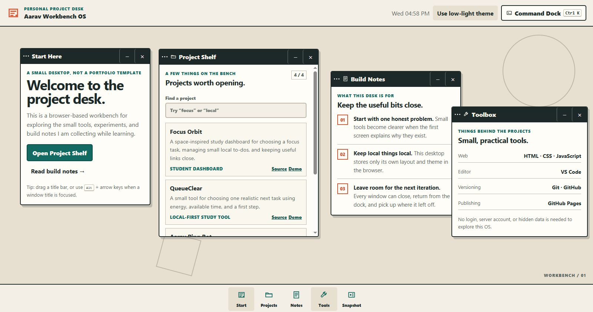

# Aarav Workbench OS

A local-first, browser-based project desk for exploring Aarav's small tools, build notes, and practical experiments through movable windows.

## What it is

Aarav Workbench OS is intentionally a focused browser workbench rather than a copy of a computer operating system. It helps a visitor browse documented projects, keep a small private note or journal draft, adjust the desk, and take a short offline break without an account.

The public app has no sign-in, password, cloud sync, server-side storage, analytics, or Workbench backend API. It cannot browse arbitrary files, open installed apps, run PowerShell or other shell commands, or optimize a visitor's operating system. If a visitor actively chooses a wallpaper image, the browser uses only that selected image during the open tab.

## Features

- Multiple draggable, closable, and minimizable windows with dock restore and front-of-stack focus
- Live local clock, Command Dock (`Ctrl`/`Cmd` + `K`), and `Alt` + arrow movement for a focused title bar
- Project Shelf with verified public source/demo links, plus Build Notes and Toolbox windows
- **Notebook** and **Story Journal** for browser-local writing; each has its own clear control and confirmation
- Optional browser speech recognition for the journal, only after a visitor starts it and their browser handles permission; Workbench does not retain audio
- **Theme Lab** with Paper, Night, Moss, and Ember themes, a WebOS-only quieter-motion setting, and a session-only custom wallpaper preview
- **Game Room** with Signal Sprint reaction play and Desk Grid memory matching; local best scores persist in the browser
- **Workbench Console** with a small allowlist of browser-only commands such as `help`, `open notebook`, `open games`, `theme moss`, `status`, and `clear`
- **Launchpad** links that open YouTube, Facebook, and Instagram in a new tab without embedding, signing in to, or controlling those services
- A browser-local check-in streak that is not coding time, a Stardance reward, transferable value, or a prize
- Mobile stacked-window layout and reduced-motion support

## Local data and privacy boundary

All saved Workbench state is namespaced under `aarav-workbench-os.*` in the visitor's own browser. The app may save:

- desktop window layout, state, z-order, and a local save timestamp;
- theme and quieter-motion preference;
- Notebook title/body and Story Journal text;
- local check-in streak date/count; and
- local best scores for the two games.

The custom wallpaper chooser uses a temporary in-memory object URL only. It does not store the image bytes, file path, filename, or object URL, and it is removed on refresh or when the visitor clicks Remove temporary wallpaper.

Browser-local writing and preferences are not encrypted. They are appropriate for ordinary notes, not secrets or sensitive personal information—especially on a shared device.

Reset layout changes only the desktop layout. It does not clear writing, themes, streaks, or game scores. Clearing Notebook or Story Journal text always uses its own visible confirmation and affects only that selected Workbench key.

The optional speech-recognition feature depends on the browser and its permission/service behavior. If used, the browser may send spoken audio to its own speech service; avoid dictating sensitive information. Workbench stores only the resulting text draft if the browser supplies one; it does not make or keep an audio recording.

## Browser-only Console

The Workbench Console is deliberately not a terminal. It does not evaluate JavaScript, shell syntax, PowerShell, command prompts, file paths, or app-launch requests. Unknown input receives a local explanatory message. Console output is temporary and is not saved.

## Run locally

No dependency installation is required.

1. Open this folder in VS Code.
2. Start a static server, for example:

   ```powershell
   py -m http.server 4173
   ```

3. Open `http://127.0.0.1:4173` in a browser.

Run the source checks with:

```powershell
npm run check
git diff --check
```

The exact observed results and honest test limits are in [TESTING.md](TESTING.md).

## Deployment

The public GitHub Pages demo is:

- https://aaravkatiyar55-gif.github.io/aarav-workbench-os/

It is a public, password-free static page. After a push to `main`, GitHub Pages publishes from the repository root; the deployed page must be checked in a fresh browser tab before release claims are made.

## Screenshot

This is a real capture of the foundational deployed desktop. A later clean capture of the expanded local-first desktop is prepared only after that deployed version is verified.



## Future companion boundary

An installable `aarav-workbench-companion` would be a separate future project, not part of this website or its Stardance evidence. It would require a separate security design, explicit opt-in permissions, and its own release process before it could access any computer resources.

## AI usage

OpenAI Codex was used for planning, implementation assistance, debugging, testing guidance, documentation, and deployment preparation. The project’s Stardance declaration, README, devlogs, and test evidence must describe actual work and must not claim human-only authorship, unsupported behavior, approval, or rewards.

## Current status

The local-first expansion has been implemented and is being checked locally. Public deployment verification, a clean expanded screenshot, factual devlog drafts, Stardance project-info updates, and any final Ship action remain separate actions and are performed only when genuinely ready and explicitly approved.
